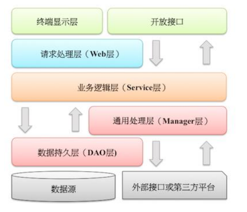

# 应用分层

1. **[推荐]** 图中默认上层依赖于下层, 箭头关系表示可直接依赖, 如: 开放接口层可以依赖于 `Web` 层, 也可以直接依赖于 `Service` 层, 依此类推:

    

    * 开放接口层: 可直接封装 `Service` 方法暴露成 `RPC` 接口；通过 `Web` 封装成 `http` 接口；进行网关安全控制, 流量控制等;

    * 终端显示层: 各个端的模板渲染并执行显示的层; 当前主要是 `velocity` 渲染, `JS` 渲染, `JSP` 渲染, 移动端展示等;

    * `Web` 层: 主要是对访问控制进行转发, 各类基本参数校验, 或者不复用的业务简单处理等;

    * `Service` 层: 相对具体的业务逻辑服务层;

    * `Manager` 层: 通用业务处理层, 它有如下特征:

        1. 对第三方平台封装的层, 预处理返回结果及转化异常信息；

        1. 对 `Service` 层通用能力的下沉, 如缓存方案, 中间件通用处理；

        1. 与 `DAO` 层交互, 对多个 `DAO` 的组合复用;

    * `DAO` 层: 数据访问层, 与底层 `MySQL`, `Oracle`, `Hbase` 等进行数据交互;

    * 外部接口或第三方平台: 包括其它部门 `RPC` 开放接口, 基础平台, 其它公司的HTTP接口;

1. **[参考]** 分层异常处理规约:

    1. `DAO` 层: 产生的异常类型有很多, 无法用细粒度的异常进行 `catch`, 使用`catch(Exception e)`方式, 并 `throw new DAOException(e)`, 不需要打印日志, 因为日志在 `Manager`/`Service` 层一定需要捕获并打印到日志文件中去, 如果同台服务器再打日志, 浪费性能和存储;

    1. `Service` 层: 出现异常时, 必须记录出错日志到磁盘, 尽可能带上参数信息, 相当于保护案发现场; 如果 `Manager` 层与 `Service` 同机部署, 日志方式与 `DAO` 层处理一致, 如果是单独部署, 则采用与 `Service` 一致的处理方式;

    1. `Web` 层: 绝不应该继续往上抛异常, 因为已经处于顶层, 如果意识到这个异常将导致页面无法正常渲染, 那么就应该跳转到友好错误页面, 加上用户容易理解的错误提示信息; 开放接口层要将异常处理成错误码和错误信息方式返回;

1. **[参考]** 分层领域模型规约:

    * `DO` (`Data Object`): 与数据库表结构一一对应, 通过 `DAO` 层向上传输数据源对象;

    * `DTO` (`Data Transfer Object`): 数据传输对象, `Service` 或 `Manager` 向外传输的对象;

    * `BO` (`Business Object`): 业务对象; 由 `Service` 层输出的封装业务逻辑的对象;

    * `AO` (`Application Object`): 应用对象; 在 `Web` 层与 `Service` 层之间抽象的复用对象模型, 极为贴近展示层, 复用度不高;

    * `VO` (`View Object`): 显示层对象, 通常是 `Web` 向模板渲染引擎层传输的对象;

    * `Query`: 数据查询对象, 各层接收上层的查询请求;

        **[强制]** 超过 2 个参数的查询封装, 禁止使用 `Map` 类来传输;
